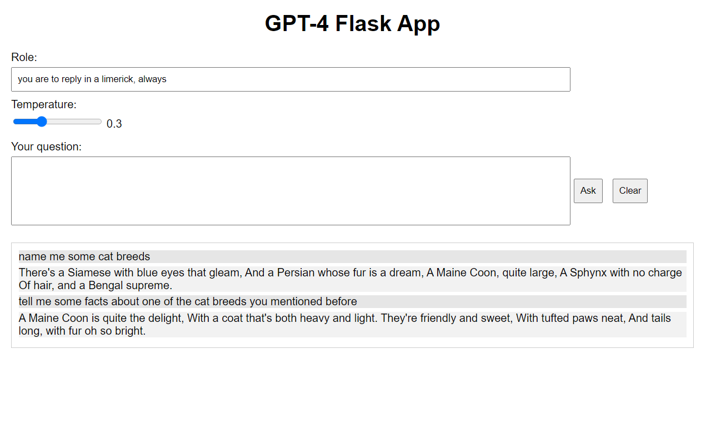

# GPT UI

This is a simple UI for the GPT-4 model. It allows you to enter a prompt and get a response from the model.

## Usage: 

Place your API key in a .env file in the root directory. 

```
OPENAI_API_KEY=your_key_here
```

Then run the following commands:

```bash
pip install -r requirements.txt
./run.py
```

Then navigate to http://localhost:5000/ in your browser.

## Screenshots

